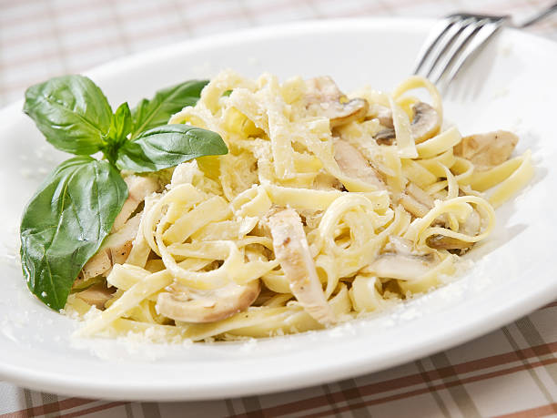

# Pantry Cook

### What is this repository for? ###

This is the README document for CS 3398.253 Spring 2026 Hutt's semester project: Recipe App.
The purpose of this project is to provide a UI where you can input ingredients (i.e. what you have at home)
and be provided recipes that use those ingredients and only those ingredients. This is for people who want
to cook with what they already have. This app has the potential to reduce home food waste and povide a way to
cook on budget.

## Table of Contents
* [How do I get set up?](#how-do-i-get-set-up)
* [General Info](#general-information)
* [Contribution Guidelines](#contribution-guidelines)
* [Technologies Used](#technologies-used)
* [Features](#features)
* [Images](#images)
* [Usage](#usage)
* [Project Status](#project-status)
* [Room for Improvement](#room-for-improvement)
* [Acknowledgements](#acknowledgements)
* [Contact](#contact)

## How do I get set up?

### Prerequisites
- [Node.js](https://nodejs.org/) (v18 or higher)
- npm (comes with Node.js)

### Installation
1. Clone the repository
2. Navigate to the project directory
3. Install dependencies:
   ```bash
   npm install
   ```

### Running the Development Server
Start the local dev server:
```bash
npm run dev
```
This will open the app at `http://localhost:5173/`. The server hot-reloads automatically — any file changes you save will instantly update in the browser.

To also access the app from a phone or another device on the same Wi-Fi network:
```bash
npm run dev -- --host
```
This exposes a **Network URL** (e.g. `http://192.168.x.x:5173/`) that you can open on any device connected to the same network.

Stop the server with `Ctrl + C`.

### Running Unit Tests
Run the full test suite:
```bash
npm test
```
This runs all 38 unit tests using [Vitest](https://vitest.dev/). Tests cover the API services, RecipeContext, and all React components. All fetch calls are mocked — no API keys or internet connection needed.

To run tests for a specific file or folder:
```bash
npx vitest run src/api/__tests__/         # API service tests only
npx vitest run src/context/__tests__/     # RecipeContext tests only
npx vitest run src/components/            # All component tests
```

To run tests in watch mode (re-runs on file changes):
```bash
npm test -- --watch
```

### Building for Production
To deploy or present the app, run:
```bash
npm run build
```
This compiles and bundles all the project files (JSX, CSS Modules, etc.) into a `dist/` folder containing plain HTML, CSS, and JS that any browser can run — no Node.js or dev server needed. You can upload the `dist/` folder to any web host to make the app publicly accessible.

## General Information
- This app solves the common problem of not knowing what to cook with the ingredients you already have at home.
- Users select ingredients from a form, and the app returns matching recipes using the Spoonacular API.
- The goal is to reduce food waste and help users cook on a budget without needing to buy extra ingredients.

## Contribution guidelines

* Writing tests
* Code review
* Other guidelines

## Technologies Used
- **Vite** — Build tool and development server
- **React 19** — Frontend UI library
- **React Router DOM** — Client-side page routing
- **CSS Modules** — Scoped component styling
- **Spoonacular API** — Recipe search by ingredient
- **Express** — Backend server (for API calls)
- **JavaScript (ES6+)** — Programming language

## Features
- MVP: webpage with radial buttons of searchable ingredients (API is queried for recipies matching each button chosen, overlaping recipes returned), returns (visible to user) list of recepies (format TBD*)
    * list of images of recepies (with name?) that are clickable links, just list of recipe names that are clickable links; API returns as json
- initially, the only retention is: user is returned a downloadable recipe

**Specific features for MVP:**
* Choose your ingredient: Multi-select Buttons search form for ingredients
* Search for recipe: Search button (i.e. click all buttons. do not search until search button AKA do not search after each updated button selections)
* Recipes are searched for: Recipes are returned that are relevant (i.e. do contain ingredients from form)
    * recipes are returned with NAME of recipe, PICTURE(?) (less important) and LINK to full recipe/recipe discription
    * recipes are returned in RELAVANCY order (i.e. most matching ingredients comes before fewer matching ingredients)
* Make Recipes Downloadable: All recipes can be downloaded as PDFs by user from DOWNLOAD button... on each recipe display (i.e. with name of recipe/image/link)
    - specific task suggested by Claude, per Spring Assignment 4: (for full discriptions of each task, see Jira: User Story 4, subtasks)
        * Task 1 – Design the Print/Download UI Component
        * Task 2 – Implement the Print Functionality (React + Browser API)
        * Task 3 – Implement the PDF Download Functionality (Client-Side Generation)
        * Task 4 – Build the Express API Endpoint for Server-Side Recipe Retrieval
        * Task 5 – Unit Testing for Print/Download Features

**Potential future features/improvements:**
- Operation Make it Better:
    text entry of ingredients; recepies are returned based on compliance with 'only use ingredients listed by user'
- Operation Make it Better-er:
    search for recepies based on compliance with 'ingredients not listed by user are...' CHEAP to find, EASY to find, etc
- Dificult Side Quest:
    user input images of ingredients, rather than text entry of ingredients. Ingredients are accurately catagorized in such a way that MVP (and potential future) search functions work as normal with image ingredient entry.
- (Hopefully) Easy Side Quest:
    filter recepies by TYPE of food (i.e. cusine)
- Operation Independance Day:
     host our own database, so as API is used to query recepies, database is built, so in future API becomes less relevant for accessing recipes from existing database of recipies

**User Stories for Features**
- Details for each user story and acceptance criteria can be found in Jira.

>User Story 1: Individual UI Tiles for Recipes Returned (frontend)
>
>   As a user, I would like to see recipes displayed as individual tiles after entering my available ingredients so that I can quickly browse what I'm able to cook with what I have on hand.

>User Story 2: Form Display for User Input (frontend)
>
>   As a user, I would like a form where I can enter the ingredients I currently have in my kitchen so that the app can find recipes I can actually make right now.

>User Story 3: Full Recipe Listing (frontend)
>
>   As a user, I would like to view the full details of a recipe I selected from my search results so that I can see all the ingredients and step-by-step instructions needed to make the dish.

>User Story 4: Download/Print Recipe (frontend)
>
>   As a user, I would like to download or print a recipe so that I can follow the instructions in my kitchen without needing to keep the app open on my device.

>User Story 5:Navigation Toolbar (frontend)
>
>   As a user, I would like a navigation toolbar so that I can easily switch between searching for recipes with my ingredients, viewing my cooking history, and accessing my saved recipe collection.

>User Story 6: User Form Data (Requests) (backend)
>
>   As a back end developer, I would like the app to accept and process the list of ingredients I submit so that it can search for recipes that match what I have available.


>User Story 7: Make Multiple API Requests for Recipe Listing (backend)
>
>   As a back end developer, I would like the app to search across multiple sources or queries based on my ingredient list so that I get a comprehensive set of recipes I can make with what I have.

>User Story 8: Filter Recipes for Multiple Ingredients from Multiple Calls (backend)
>
>   As a back end developer, I would like the app to intelligently combine and filter results from multiple searches so that I see recipes ranked by how well they match the ingredients I have on hand.

>User Story 9: Storing User Recipe History Locally (backend)
>
>   As a back end developer, I would like the app to keep track of recipes I've viewed so that I can easily find and revisit dishes I was interested in without searching for them again.

>User Story 10: Non-Temporary Library Storage (backend)
>
>   As a back end developer, I would like to save favorite recipes to a permanent personal library so that I can build a go-to collection of meals I know I can make and access them anytime.


## Images
  #### Example Query: ####
Find recipe with: ☑ chicken | ☑ parmesan | ☑ cream



## Usage
1. Start the dev server: `npm run dev`
2. Open `http://localhost:5173/` in your browser
3. Use the ingredient search form to select ingredients you have at home
4. Click Search to find matching recipes
5. Browse recipe tiles with names, images, and links
6. Download or print any recipe as a PDF


## Project Status
Project is: _in progress_ as of 13/02/2026 (Feb.)


## Room for Improvement
Include areas you believe need improvement / could be improved. Also add TODOs for future development.

Room for improvement:
- Improvement to be done 1
- Improvement to be done 2

To do:
- MVP
- improved search style
    * image user entry
- improved search method
- databse


## Acknowledgements
Give credit here.
- This project was inspired by...
- This project was based on [this tutorial](https://www.example.com).
- Many thanks to...


## Contact
Created by Miguel Alvarez, Tina Carter, Juan Estrada, Christian Johnson, Patrick Rucker
