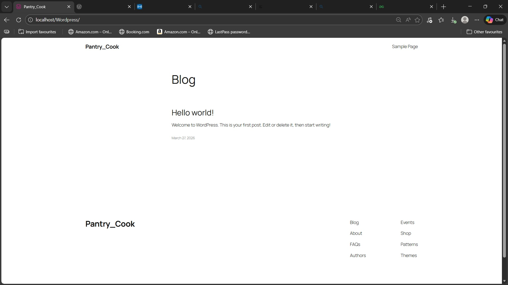
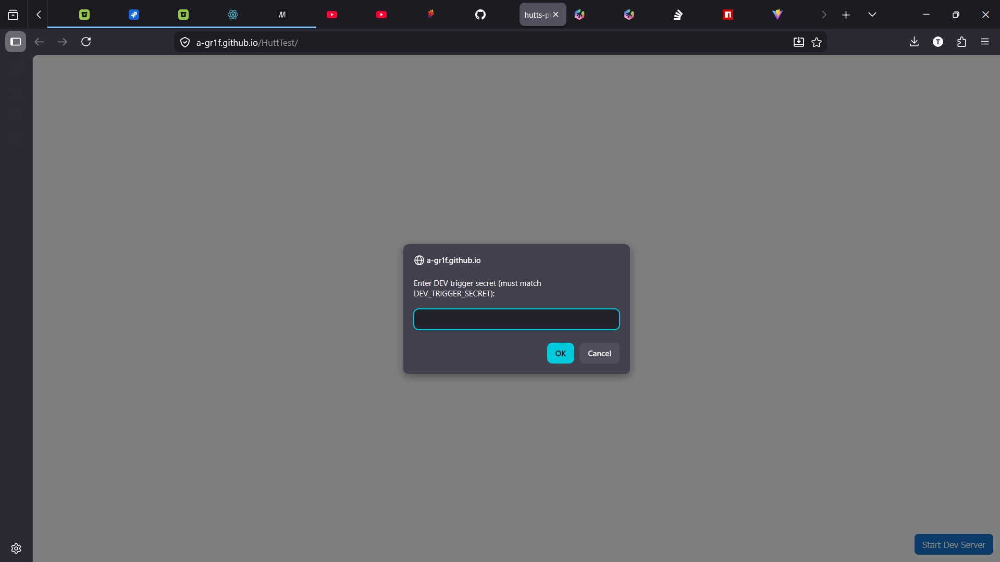
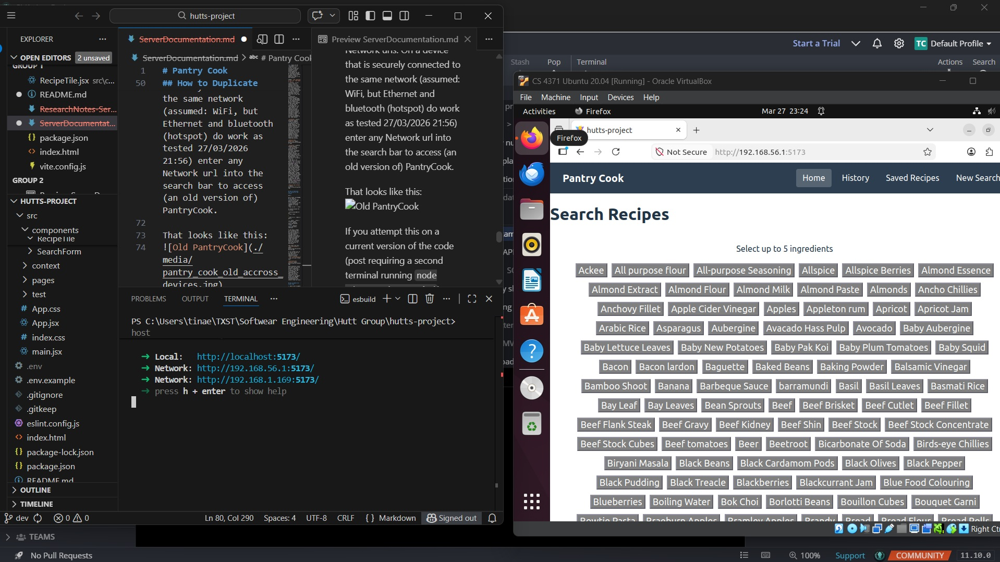
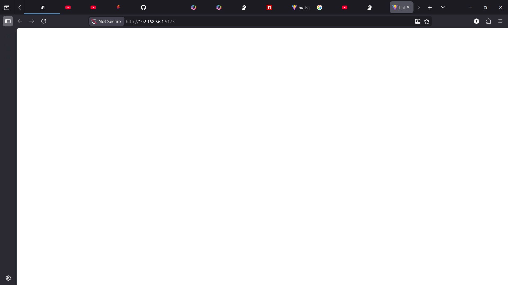

# Pantry Cook
#### Document Owned by: Tina Carter

## Table of Contents
* [References Used](#references-used)
* [Current State of the Server](#current-state-of-the-server)
* [How to Duplicate this Portion of the Project](#how-to-duplicate-this-portion-of-the-project)
* [How to Update the Global Page](#how-to-update-the-global-page)

## References Used
`Ubuntu 25.10` `Apache 2.4.43` `Wampserver 3.4.0` `GitHub Pages` `Wordpress 6.9.1`

 &emsp; "Publish Websites on Github Pages with a Custom Domain," geeksforgeeks, https://www.geeksforgeeks.org/git/publish-websites-on-github-pages-with-a-custom-domain/.
 &emsp; "How to set up Port Forwarding on the Linksys Smart WiFi router using the local access interface," linksys, https://support.linksys.com/kb/article/318-en/.
 &emsp; _download wordpress,_ wordpress, https://wordpress.org/download/.
 &emsp; "About npm," npm Docs, https://docs.npmjs.com/about-npm
 &emsp; "What does npm run do?" stackoverflow, https://stackoverflow.com/questions/49275342/what-does-npm-run-do.
 &emsp; "Build a Simple Dynamic Site with Node.js," teamtreehouse, https://teamtreehouse.com/library/build-a-simple-dynamic-site-with-nodejs.
 &emsp; "How to call nodejs in html file?" teamtreehouse, https://teamtreehouse.com/community/how-to-call-nodejs-in-html-file.
 &emsp; _download apache,_ apache, https://httpd.apache.org/.
 &emsp; Indigo Software LLC, "How To Host Your Own Website For Free," youtube, https://www.youtube.com/watch?v=LnOaURGIdbA.
 &emsp; Redian TopNotch Programmer, "How to Host your Website locally into a Ubuntu Virtual Machine," youtube, https://www.youtube.com/watch?v=U-Xi0EsMI0Y.

 &emsp; Author(?) "Title of Website or Video or Document," host location (i.e. geeks for geeks), https://url-access-example.

## Current State of the Server 
`functional` but `out of date` internal to a network access accross devices
  `Ubuntu 25.10` `VirtualBox 7.1.12` 
* keep the local version running (not including a second terminal running .server/mongo.js)
* the website can now be accessed by anyone on that network without needing to have or deploy the code or run any terminals

ISSUES: `time remaining to fix: 10` `time spent so far: 5`
* currently, server/mongo.js must be running on the same machine as the place the website is accessed (i.e. the mongo.js is not being transmitted on the open network URL)
--> the most recently available version of PantryCook that this works for it from last week.
* fixing this necessitates more closely linking mongo.js with the deployment of the website overall OR also making the mongo.js call avaiable in the network URL
* calling 'node ./server/mongo.js/' in the terminal of the 'other device' (in addition to being counterproductive to the point of hosting the website without needing to comand line it) doesn't work without the codebase also being avaiable on the 'other device'

`placeholder` locally accessable website linked to codebase
* in the process of attempting to make a global website, a (not globally deployed, so trivial to do so over network, and fairly east to do so) a webpage with a server and database through wordpress that is not associated with our codebase has been deployed. Attaching this to our codebase would be a fairly cumbersome process.

`placeholder` globally avaiable website
* the link "https://a-gr1f.github.io/HuttTest/" is a currently in progress link that leads to a website that is globally avaiable and associated with up to date codebase (as of 27/03/2026 14:37), but that doesn't acctually access it.
* the code in the gitHub repo it is built from is _not_ from any development code in our bitbucket, because index.html, package.json, and vite.config.js have been modified and start-dev.js has been created such that (rather than a blank page, as loads if gitHub page is loaded through dev2, the most up to date branch 27/03/2026) a button asking to 'Start Dev Server' is present, that when pushed (and key input) attempts _and fails_ to load the comand prompts that lead to the website opeing locally 

## How to Duplicate this Portion of the Project

Don't.

### out of date but functional accross a network:
Out of date: see README.md for details.
 You must be on a version of the code before 24/03/2026
 In terminal, in the location where this codebase is stored, type:
> npm run dev -- --host

It should display the following: 

> hutts-project@0.0.0 dev
> vite --host
>
>
> VITE v7.3.1  ready in 568 ms
>
> ➜  Local:   http://localhost:5173/
>  ➜  Network: http://192.168.56.1:5173/
>  ➜  Network: http://192.168.1.169:5173/

It may have a longer list of Network urls. On a device that is securely connected to the same network (assumed: WiFi, but Ethernet and bluetooth (hotspot) do work as tested 27/03/2026 21:56) enter any Network url into the search bar to access (an old version of) PantryCook. 

That looks like this, using VirtualBox to simulate a second device:

If you attempt this on a current version of the code (post requiring a second terminal running `node ./server/mongo.js/`) you will get a blank page:

Other potential issues you could run into are unsecure connection errors. I did't get a screenshot, but the error message is something link 'you have a non-secure connection to this network, so you cannot access this webpage'. Disconnecting and reconnecting to the network fixed the issue.

### GitHub Pages

The geeksforgeeks instructions are very clear to follow, so see them for more detail: https://www.geeksforgeeks.org/git/publish-websites-on-github-pages-with-a-custom-domain/.

From bitbucket reposetory, copy link as though you were cloning it to a new location. In GitHub, import the repository using that link. It must be **public** or you must have a paid version of GitHub.

Go to Settings > Pages.

Under **Build and Deploy** choose "deploy from branch," then choose the branch dev2 (OR main, post 29/03/2026). Keep /root selected, as `index.html` is located in root, not in /docs. Save.

There will be a link that populates in the form `https://account-name.github.io/RepoName/`. Custom domain names can be applied in the relevant box, but I did not do this.

To have this link populate somthing other than a blank page, use branch `SCRUM-103-test-branch`. It contains an extra file and changes to index.html that cause the link to populate a page with a button that tries (and, due to two terminal command requirements of our current code, fail) to force the terminal comands to run, which would populate a local version of PantryCook in the same way running npm run dev does in commandline, were these changes implemented on dev (not dev2) or any other version of the code from before 24/03/2026.

### Wordpress/run a server

I used apache2, so downloading that is necessary to perform the same steps. Then, mostly following Indigo LLC and Redian's instructions, a webpage could be hosted that is globally avaiable.

This resulted in a blank wordpress website that wasn't related to our codebase.

Major pitfall 1: I changed locations (and thus wifi/router information) in the middle of testing this, so had to start the non-localisation process all over on 27/03/2026, including searching for the physical router. I do not recomend that you duplicate this step.

Major pitfall 2: I was running this in VirtualBox (which is very slow when running so much code in it and on my main OS), which made permissions for moving code to the /var/www/http file very dificult (due to root and admin privileges being different from my primary OS) so the PantryCook code couldn't be associated with the database I made to hold the wordpress temporary/placeholder website.

## How to Update the Global Page

1. what to do to update the server.
2. and then this.
3. another step.

## Project By:
Miguel Alvarez, Tina Carter, Juan Estrada, Christian Johnson, Patrick Rucker